# V001 ER 다이어그램 (RDS 18 테이블 + R2 정적 경계)

> RDS 18 테이블 (spec § 5)과 R2 정적 데이터 (spec § 4)의 관계도.
> Mermaid `erDiagram`은 R2 entity를 점선으로 표현하지 못해서 *별도 섹션*에 명시.

## RDS 동적 (18 테이블)

```mermaid
erDiagram
    user ||--o{ listing : owns
    user ||--o{ bookmark_listing : has
    user ||--o{ bookmark_external : has
    user ||--o{ search_history : performs
    user ||--o{ analysis_report : owns
    user ||--o{ notification : receives
    user ||--o{ business_verification_queue : submits
    user ||--o{ listing_report : reports
    user ||--o{ admin_action : performs
    user ||--o{ system_alert : acknowledges
    user ||--o{ featured_content : purchases
    user ||--o{ pipeline_schedule : updates
    user ||--o{ pipeline_run : triggers

    listing ||--o{ listing_photo : has
    listing ||--o{ bookmark_listing : bookmarked_by
    listing ||--o{ listing_review_queue : reviewed_by
    listing ||--o{ listing_report : reported_in

    pipeline_schedule ||--o{ pipeline_run : executes

    user {
        char(30) id PK
        varchar zitadel_sub UK
        varchar email UK
        varchar(12) business_number
        text[] roles
        timestamptz deleted_at "soft-delete (PIPA RTBF)"
    }
    listing {
        char(30) id PK
        char(30) owner_id FK
        char(19) parcel_pnu "R2 매핑 (FK 아님)"
        varchar listing_type
        varchar transaction_type "sale/monthly_rent/jeonse"
        bigint price_krw
        bigint version "optimistic locking"
    }
    listing_photo {
        char(30) id PK
        char(30) listing_id FK "ON DELETE CASCADE"
        text r2_key "R2 객체 경로"
    }
    bookmark_listing {
        char(30) user_id PK "FK to user"
        char(30) listing_id PK "FK to listing"
    }
    bookmark_external {
        char(30) id PK
        varchar target_kind "parcel/court_auction/manufacturer/industrial_complex"
        varchar target_id "PNU 또는 R2 식별자"
    }
    search_history {
        char(30) id PK
        char(30) user_id FK "nullable (비로그인)"
        text query
        jsonb filters
    }
    analysis_report {
        char(30) id PK
        char(30) user_id FK
        char_array target_pnus "필지 배열"
        jsonb snapshot "R2 시점 캐시"
    }
    notification {
        char(30) id PK
        char(30) user_id FK
        timestamptz read_at "partial idx where null"
    }
    audit_log {
        char(30) id PK
        char(30) actor_id "no FK (살아남음)"
        jsonb before_state
        jsonb after_state
    }
    outbox_event {
        char(30) id PK
        timestamptz published_at "queue marker"
    }
    pipeline_schedule {
        char(30) id PK
        varchar pipeline_kind UK
        varchar cron_expression
        bigint version "optimistic locking"
    }
    pipeline_run {
        char(30) id PK
        char(30) schedule_id FK
        varchar status "5-state enum"
        jsonb steps "admin UI 노드 그래프"
        jsonb output_hashes "변경 감지"
    }
    admin_action {
        char(30) id PK
        char(30) admin_id FK
        varchar target_kind "polymorphic"
        varchar target_id
    }
    business_verification_queue {
        char(30) id PK
        char(30) user_id FK
        varchar status "4-state enum"
    }
    listing_review_queue {
        char(30) id PK
        char(30) listing_id FK "ON DELETE CASCADE"
        varchar decision "3-state enum"
    }
    listing_report {
        char(30) id PK
        char(30) listing_id FK
        char(30) reporter_id FK "nullable (익명)"
        varchar reason "6-value enum"
    }
    featured_content {
        char(30) id PK
        varchar target_kind "listing/industrial_complex/manufacturer"
        varchar feature_kind "homepage/search_top/sponsored/newsletter"
        timestamptz starts_at
        timestamptz ends_at
    }
    system_alert {
        char(30) id PK
        varchar severity "info/warning/error/critical"
        timestamptz acknowledged_at "partial idx where null"
    }
```

## R2 정적 (DB 외부 — 참고)

다음 entity는 RDS가 아니라 R2 객체 저장소에 PMTiles/JSON으로 보관됨 (spec § 4):

- **Core BC** — Parcel (V-World 필지), Building (건물), IndustrialComplex (산업단지), Manufacturer (제조사)
- **Market BC** — RealTransaction (실거래가 이력), CourtAuction (경매)
- **Regulation BC** — Law (법령), Regulation (규제)

RDS의 `listing.parcel_pnu` (char 19), `bookmark_external.target_id`, `analysis_report.target_pnus[]`,
`featured_content.target_id`는 R2 entity 식별자를 보유하지만 **FK 제약이 아니에요** (cross-store 매핑).

## SSOT 매핑

이 다이어그램은 *유도된 산출물*이에요. 변경 시 수정 순서:

1. **spec § 5** (RDS 정의) → 코드 SSOT
2. **migrations/V001_*.sql** → DB 정의
3. **본 다이어그램** → 시각화 (마지막 갱신)

다이어그램이 spec과 다르면 *spec이 정답*이에요.
