# Gongzzang Runtime ER Overview

This document describes the Gongzzang-owned runtime data model only.

Catalog ETL, raw public API archive, and API drift observability tables are
Platform Core concerns. Historical Gongzzang migrations still contain a few
legacy tables until an approved drop migration is created, but they are not
part of the active Gongzzang ER model:

- `pipeline_schedule`
- `pipeline_run`
- `parcel_external_data`
- `api_health_check`

The authoritative ledger for those temporary schema remnants is
`docs/architecture/platform-core-boundary.v1.json`
`allowed_legacy_schema_tokens`.

## Active RDS Model

```mermaid
erDiagram
    user ||--o{ listing : owns
    user ||--o{ bookmark_listing : has
    user ||--o{ bookmark_external : has
    user ||--o{ search_history : performs
    user ||--o{ analysis_report : owns
    user ||--o{ notification : receives
    user ||--o{ business_verification_queue : submits
    user ||--o{ listing_report : reports
    user ||--o{ admin_action : performs

    listing ||--o{ listing_photo : has
    listing ||--o{ bookmark_listing : bookmarked_by
    listing ||--o{ listing_review_queue : reviewed_by
    listing ||--o{ listing_report : reported_in
    listing ||--|| listing_marker_projection : projects_to

    parcel_marker_anchor ||--o{ listing_marker_projection : anchors
    listing_marker_filter_registry ||--o{ listing_marker_projection : filters

    user {
        char_30 id PK
        varchar zitadel_sub UK
        varchar email UK
        varchar_12 business_number
        text_array roles
        timestamptz deleted_at
    }
    listing {
        char_30 id PK
        char_30 owner_id FK
        char_19 parcel_pnu
        varchar status
        varchar listing_type
        varchar transaction_type
        bigint price_krw
        bigint version
    }
    listing_photo {
        char_30 id PK
        char_30 listing_id FK
        text r2_key
    }
    listing_marker_projection {
        text marker_id UK
        char_30 listing_id FK
        char_19 pnu
        geometry anchor_point
        text anchor_snapshot_id
        bigint source_listing_version
    }
    parcel_marker_anchor {
        char_19 pnu PK
        geometry anchor_point
        text anchor_snapshot_id
        text source_geometry_checksum_sha256
    }
    listing_marker_filter_registry {
        text filter_hash PK
        jsonb spec
        bigint request_count
    }
    bookmark_listing {
        char_30 user_id PK
        char_30 listing_id PK
    }
    bookmark_external {
        char_30 id PK
        char_30 user_id FK
        varchar target_kind
        varchar target_id
    }
    search_history {
        char_30 id PK
        char_30 user_id FK
        text query
        jsonb filters
    }
    analysis_report {
        char_30 id PK
        char_30 user_id FK
        char_array target_pnus
        jsonb snapshot
    }
    notification {
        char_30 id PK
        char_30 user_id FK
        timestamptz read_at
    }
    audit_log {
        char_30 id PK
        char_30 actor_id
        jsonb before_state
        jsonb after_state
    }
    outbox_event {
        char_30 id PK
        timestamptz published_at
    }
    admin_action {
        char_30 id PK
        char_30 admin_id FK
        varchar target_kind
        varchar target_id
    }
    business_verification_queue {
        char_30 id PK
        char_30 user_id FK
        varchar status
    }
    listing_review_queue {
        char_30 id PK
        char_30 listing_id FK
        varchar decision
    }
    listing_report {
        char_30 id PK
        char_30 listing_id FK
        char_30 reporter_id FK
        varchar reason
    }
```

## Cross-Service References

`listing.parcel_pnu` is not a foreign key into a Gongzzang-owned `parcel`
table. Canonical parcel geometry and anchor lineage are owned by Platform Core.
Gongzzang keeps only the `parcel_marker_anchor` read-model copy required for
listing marker serving.

## Update Order

1. Migrations in `migrations/*.sql`
2. Rust repository/domain contracts
3. This diagram

If this document conflicts with migrations or the boundary ledger, the
migrations plus `docs/architecture/platform-core-boundary.v1.json` win.
